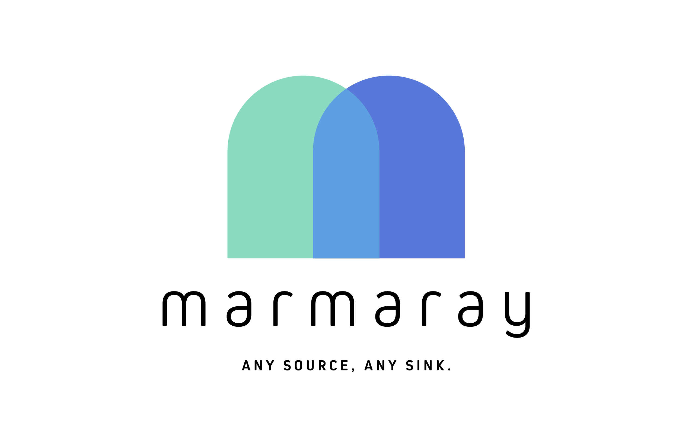
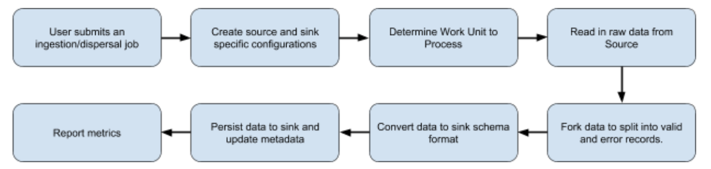
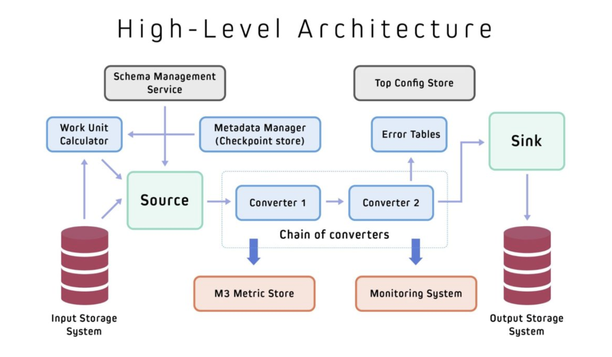
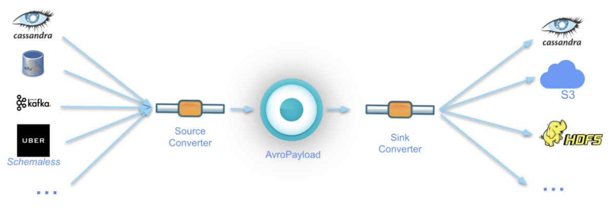
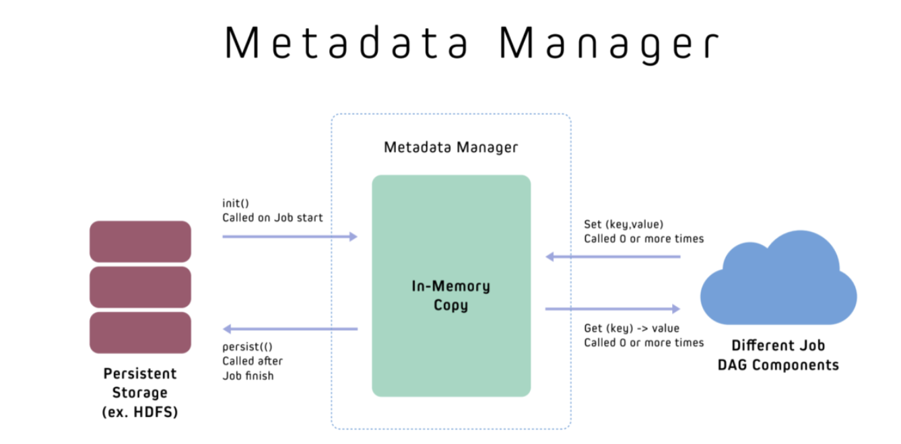
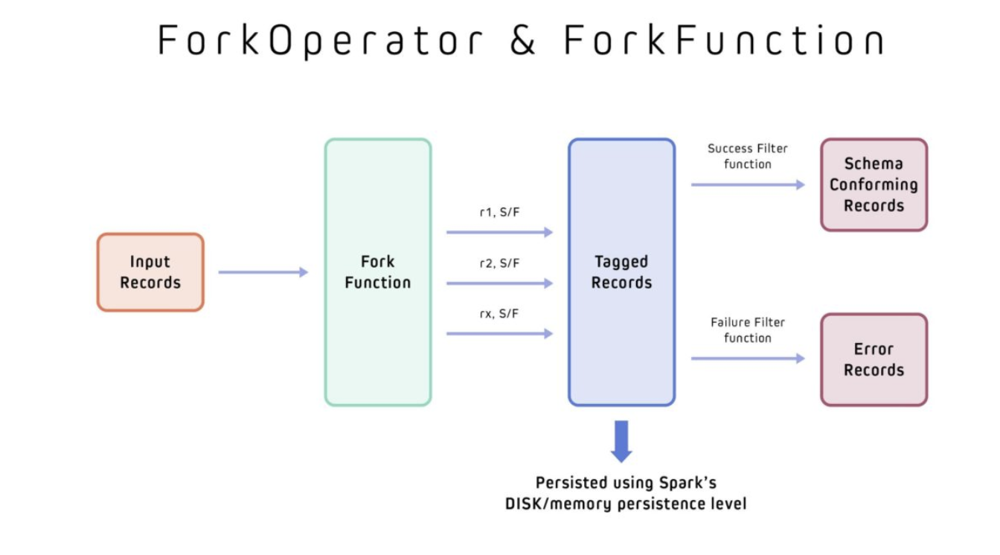

# Marmaray

    

_Note: For an End to End example of how all our components tie together, please see com.uber.marmaray.common.job.JsonHoodieIngestionJob_

Marmaray is a generic Hadoop data ingestion and dispersal framework and library.  It is a plug-in based framework built on top of the Hadoop ecosystem where support can be added to ingest data from any source and disperse to any sink leveraging the power of Apache Spark.

Marmaray describes a number of abstractions to support the ingestion of any source to any sink.  They are described at a high-level below to help developers understand the architecture and design of the overall system.

This system has been canonically used to ingest data into a Hadoop data lake and disperse data from a data lake to online data stores usually with lower latency semantics.  The framework was intentionally designed, however, to not be tightly coupled to just this particular use case and can move data from any source to any sink.

**End-to-End Job Flow**

The figure below illustrates a high level flow of how Marmaray jobs are orchestrated, independent of the specific source or sink.

    

During this process, a configuration defining specific attributes for each source and sink orchestrates every step of the next job. This includes figuring out the amount of data we need to process (i.e., its Work Unit), applying forking functions to split the raw data, for example,  into ‘valid’ and ‘error’ records and converting the data to an appropriate sink format.  At the end of the job the metadata will be saved/updated in the metadata manager, and metrics can be reported to track progress.

The following sections give an overview of each of the major components that enable the job flow previously illustrated.

**High-Level Architecture**

The architecture diagram below illustrates the fundamental building blocks and abstractions in Marmaray that enable its overall job flow. These generic components facilitate the ability to add extensions to Marmaray, letting it support new sources and sinks.

    

**Avro Payload**

The central component of Marmaray’s architecture is what we call the AvroPayload, a wrapper around Avro’s GenericRecord binary encoding format which includes relevant metadata for our data processing needs.

One of the major benefits of Avro data (GenericRecord) is that it is efficient both in its memory and network usage, as the binary encoded data can be sent over the wire with minimal schema overhead compared to JSON. Using Avro data running on top of Spark’s architecture means we can also take advantage of Spark’s data compression and encryption features. These benefits help our Spark jobs more efficiently handle data at a large scale.

To support our any-source to any-sink architecture, we require that all ingestion sources define converters from their schema format to Avro and that all dispersal sinks define converters from the Avro Schema to the native sink data model (i.e., ByteBuffers for Cassandra).

Requiring that all converters either convert data to or from an AvroPayload format allows a loose and intentional coupling in our data model. Once a source and its associated transformation have been defined, the source theoretically can be dispersed to any supported sink, since all sinks are source-agnostic and only care that the data is in the intermediate AvroPayload format.

This is illustrated in the figure below: 

    

**Data Model**

The central component of our architecture is the introduction of the concept of what we termed the AvroPayload.  AvroPayload acts as a wrapper around Avro’s GenericRecord binary encoding format along with relevant metadata for our data processing needs. One of the major benefits of Avro data (GenericRecord) is that once an Avro schema is registered with Spark, data is only sent during internode network transfers and disk writes which are then highly optimized. Using Avro data running on top of Spark’s architecture means we can also take advantage of Spark’s data compression and encryption features. These benefits factor heavily in helping our Spark jobs handle data at large scale more efficiently.  Avro includes a schema to specify the structure of the data being encoded while also supporting schema evolution.  For large data files, we take advantage that each record is encoded with the same schema and this schema only needs to be defined once in the file which reduces overhead.  To support our any-source to any-sink architecture, we require that all ingestion sources define converters from their schema format to Avro and that all dispersal sinks define converters from the Avro Schema to the native sink data model (i.e ByteBuffers for Cassandra).

This allows an loose and intentional coupling in our data model, where once a source and its associated transformation has been defined, it theoretically can now be dispersed to any supported sink since all sinks are source agnostic and only care that the data is in the intermediate AvroPayload format.

**Data Converters**

The primary function of ingestion and dispersal jobs are to perform transformations on input records from the source to ensure it is in the desired format before writing the data to the destination sink.  Marmaray allows jobs to chain converters together to perform multiple transformations as needed with the potential to also write to multiple sinks.

A secondary but critical function of DataConverters is to produce error records with every transformation.  Before data is ingested into our Hadoop data lake, it is critical that all data conforms to a schema for analytical purposes and any data that is malformed, missing required fields, or otherwise deemed to have issues will be filtered out and written to error tables.  This ensures a high level of data quality in our Hadoop data lake.  This functionality is abstracted out by only exposing a “convert()” method to user.  The convert() will act on a single piece of datum from the input schema format and do one of the following:
Return an output record in the desired output schema format
Write the input record to the error table with an error message and other useful metadata or discard the record.

Using the Kafka -> Hudi (Hive) ingestion case, we use 2 converters:

KafkaSourceDataConverter
- Converts Kafka messages (byte[]) to GenericRecord (wrapped in AvroPayload as described earlier).  This record is then sent to our data lake for ingestion
HoodieSinkDataConverter
- Converts GenericRecord (wrapped in an AvroPayload) received from the data lake into a HoodieRecord which is needed for insertion into our Hoodie storage System

**Error Tables**

Error Tables are written to by DataConverters as described in a previous section.  The main purpose of error tables was to enable easy debugging of jobs and reject records which do not have a backward compatible schema change  Since some of this error data can have potentially sensitive user information, we control access to this error table on a “owner”+”table” level. In addition, once the owners have fixed the data and ensured it is schema conforming they can push the data back into the pipeline where it can now be successfully ingested.

**WorkUnit Calculator**

Marmaray moves data in mini-batches of configurable size.  In order to calculate the amount of data to process, we introduced the concept of a WorkUnitCalculator.  At a very high level, a work unit calculator will look at the type of input source, the previously stored checkpoint, and calculate the next work unit or batch of work.  An example of a work unit would be Offset Ranges for Kafka or a collection of HDFS files for Hive/HDFS source.

When calculating the next batch of data to process, a work unit can also take into account throttling information.  Examples include the maximum amount of data to read or number of messages to read from Kafka.  This is configurable per use case and gives maximum flexibility to ensure that work units are appropriately sized especially as the amount of data increases in scale and doesn’t overwhelm source or sink systems

Each WorkUnitCalculator will return a IWorkCalculatorResult which will include the list of work units to process in the current batch as well as the new checkpoint state if the job succeeds in processing the input batch.  We have also added functionality to calculate the cost of the execution of each work unit for chargeback purposes. This is very useful because now users can define various methods to compute cost using number of records, size of total records, spark executor’s effective execution time etc. As we allow multiple ingestions in a single run (i.e. multiple kafka topics can be ingested in single spark job run using separate topic specific dags.) having per topic level execution time helps in differentiating execution cost between topics.

**Metadata Manager**

All Marmaray jobs need a persistent store, known as the metadata manager, to store job level metadata information.  A job can update its state during its execution and job will replace old saved state only if current execution of the job is successful.  Otherwise, any modifications to the state are rejected. We use this for storing checkpoint information (partition offsets in case of kafka), average record size, average number of messages etc.  The metadata store is designed to be generic, however, and can store any relevant metrics that is useful to track, describe, or collect status on jobs depending on the use case and user needs.

When a job begins execution, an in memory copy of the current metadata is created and shared with the appropriate job components which will need to update the in-memory copy during job execution.  If the job fails, this in memory copy will be discarded to ensure that the next run will start from the previously saved state of the last successful run.  If the job succeeds the in-memory copy is now saved to the persistent store. As of now since the metadata manager has an in-memory copy there is a limitation on the amount of metadata a job can store

    

**Fork Operator**

The main purpose for the ForkOperator is to split the input stream of records into multiple output streams.  The canonical use case for this is to have an input stream each for valid and error records which then can be appropriately handled in an separate and independent manner.

The internal execution engine of Spark performs all operations in a manner of lazy-evaluation.  Unless an action is performed (count, forEach, etc), no data is actually read.  The ForkOperator was invented to avoid the re-execution of input transformations as well as the re-reading of data from the source which would have been very expensive.

A provided ForkFunction is used by the ForkOperator to tag each datum with a valid or error annotation.  These ForkOperators are called by our data converters during job execution.  Users can now filter to get the desired collection of tagged records.  These records are persisted in Spark to avoid having to re-read the raw input and re-apply the transformation when filtering.   By default we currently use DISK_ONLY persistence to avoid memory overhead and pressure. These components are used in DataConverters to split input stream into 2 streams (output + error) but it can be used for splitting it into more than 2 streams with overlapping records if desired.  For example, we could decide to split an input stream of integers (1 to 6) into an even number stream (2,4,6), odd number stream (1,3,5) and a multiple of 3 stream (3,6).

    

**JobDag**

The JobDag component orchestrates and performs the actual execution of the Job.  It does the following:
- Initialize the MetadataManager so checkpoint information can be retrieved
- Reads input records from the ISource to create the RDD<GenericRecord>
- Hands over the RDD to the ISink to write the data to the destination storage system
- Persists updated metadata and checkpoint information to the MetadataManager if the JobDag execution succeeded
- Report status of the job and other metrics

**JobManager**

The JobManager is responsible for running multiple JobDags.  For example, a JobDag can correspond to each topic in Kafka that is ingested, and N number of JobDags can be run by the we do instead is group together multiple JobDags as a single logical job all sharing the same SparkContext (and resources).  The JobManager will be responsible for managing each one of these JobDags and can be configured to run a certain number in parallel which results in much better resource utilization since we don’t currently take advantage of Spark’s ability to dynamically allocate resources.  The ordering of jobs can be defined to ensure longer running jobs and higher priority jobs get resources first.  The JobManager also handles reporting job success metrics and maintain registered reporters for reporting various metrics.

**ISource & ISink**

The ISource contain all the necessary information to read in the source data for the appropriate requested work units and ISink contain all the necessary information on how to write to the sink.  For example, a Cassandra sink would contain information about the cluster, table, partitioning keys, and clustering keys for where the data should reside.  A Kafka source would contain information about the topic name, maximum messages to read, cluster information, offset initialization strategy etc.

